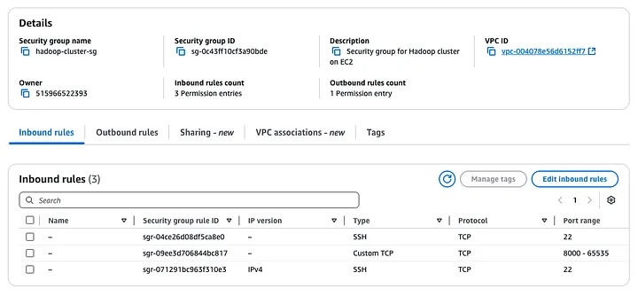
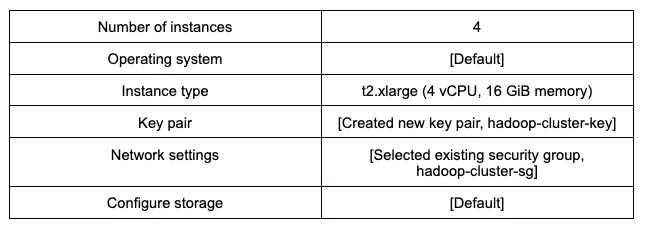
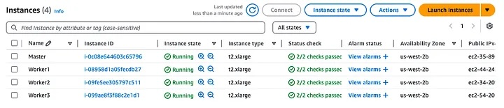
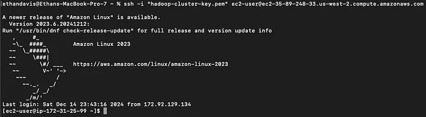
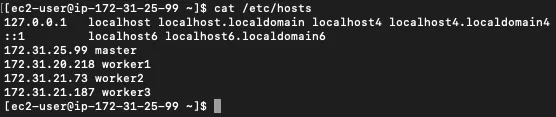
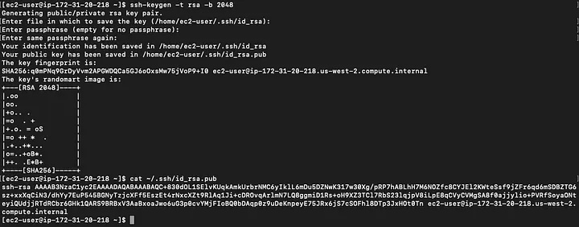
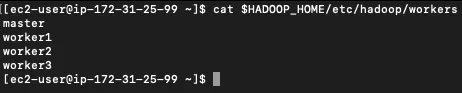

# Hadoop Cluster in AWS EC2

## Introduction

This is a tutorial for how we built a Hadoop cluster in AWS EC2 to execute ant colony optimization. The tutorial outlines the configurations of EC2 instances, Hadoop installation, and job execution steps. It is intended to help researchers reproduce our environment or adapt it for their own metaheuristc experiments.

## AWS EC2 Security Group

We created an AWS EC2 security group named `hadoop-cluster-sg`. It is in the default VPC. For inbound traffic, we opened SSH from nodes in the security group, a wide port range for TCP from nodes in the security group, and SSH from our machine in our home network. Lastly, for outbound rules, we allowed all traffic. See a screenshot of my security group below.



## AWS EC2

We created AWS EC2 instances. There are many resources to choose from. This article assumes the following resources however there is flexibility to choose different options. Then, see below for a screenshot of our EC2 instances in AWS. See that we also named each instance for convenience.





## SSH

We SSH into each node. We use our `hadoop-cluster-key` and the public IPv4 DNS of each node. The public IPv4 DNS of a node can be found by viewing the details of each node in AWS. You should see something like the following screenshot.

```bash
ssh -i "your-key.pem" ec2-user@your-public-address
```



## /etc/hosts

We name the private IPv4 addresses of our nodes. This lets us refer to each node by name rather than by address. We do this step in each node. This step is optional but improves readability. Your `/etc/hosts` should look like the following screenshot.



## Passwordless SSH

In our master node, we generate an SSH key pair. Then, we `cat` the key. These are the commands we run in my master node. You should see something like the following screenshot.

```bash
ssh-keygen -t rsa -b 2048
cat ~/.ssh/id_rsa.pub
```



We copy the key, and then, in each of our worker nodes, we manually paste the key to authorized keys. We also do this in the master node because we want to use it as a worker node. You should see no response from this command.

```bash
echo "master-key" >> ~/.ssh/authorized_keys
```

## Install Java

We install Java. We do this in each of our worker nodes. In this walkthrough, Java 11 is used. However, another version of Java could be used.

```bash
sudo yum update -y
sudo yum install -y java-11-amazon-corretto-devel
```

Lastly, we save Java to our PATH. This makes the Java installation accessible. When the following commands are run, you should see no response.

```bash
echo 'export JAVA_HOME=/usr/lib/jvm/java-11-amazon-corretto.x86_64' >> ~/.bashrc
echo 'export PATH=$JAVA_HOME/bin:$PATH' >> ~/.bashrc
source ~/.bashrc
```

## Install Hadoop

Just like the previous step, we also install Hadoop. We do this in each of our worker nodes. This walkthrough uses Hadoop 3.3.6. However, another version of Hadoop could be used.

```bash
wget https://dlcdn.apache.org/hadoop/common/hadoop-3.3.6/hadoop-3.3.6.tar.gz
tar -xzvf hadoop-3.3.6.tar.gz
```

Then, we save Hadoop to our PATH. Just like the previous step, this makes the Hadoop installation accessible. When the following commands are run, you should see no response.

```bash
echo 'export HADOOP_HOME=~/hadoop-3.3.6' >> ~/.bashrc
echo 'export PATH=$HADOOP_HOME/bin:$HADOOP_HOME/sbin:$PATH' >> ~/.bashrc
source ~/.bashrc
```

## Hadoop Workers

We edit the following file, `$HADOOP_HOME/etc/hadoop/workers`. This step should be done in each worker node. This defines the worker nodes. The names of worker nodes can be used rather than their address since we edited `/etc/hosts`. See the screenshot below of what your workers file should look like.



## core-site.xml

We edit the following file, `$HADOOP_HOME/etc/hadoop/core-site.xml`. This step should be done in each worker node. This is a configuration file that defines settings across the entire Hadoop ecosystem. For example, HDFS, MapReduce, and YARN. Below is an example of the `core-site.xml` that we use.

```xml
<?xml version="1.0" encoding="UTF-8"?>
<?xml-stylesheet type="text/xsl" href="configuration.xsl"?>
<!--
  Licensed under the Apache License, Version 2.0 (the "License");
  you may not use this file except in compliance with the License.
  You may obtain a copy of the License at

    http://www.apache.org/licenses/LICENSE-2.0

  Unless required by applicable law or agreed to in writing, software
  distributed under the License is distributed on an "AS IS" BASIS,
  WITHOUT WARRANTIES OR CONDITIONS OF ANY KIND, either express or implied.
  See the License for the specific language governing permissions and
  limitations under the License. See accompanying LICENSE file.
-->
<configuration>
    <property>
        <name>fs.defaultFS</name>
        <value>hdfs://master:9000</value>
    </property>
</configuration>
```

## hdfs-site.xml

We edit the following file, `$HADOOP_HOME/etc/hadoop/hdfs-site.xml`. This step should be done in each worker node. This is a configuration file that defines settings for HDFS. Below is an example of the `hdfs-site.xml` that we use in each of our nodes.

```xml
<?xml version="1.0" encoding="UTF-8"?>
<?xml-stylesheet type="text/xsl" href="configuration.xsl"?>
<!--
  Licensed under the Apache License, Version 2.0 (the "License");
  you may not use this file except in compliance with the License.
  You may obtain a copy of the License at

    http://www.apache.org/licenses/LICENSE-2.0

  Unless required by applicable law or agreed to in writing, software
  distributed under the License is distributed on an "AS IS" BASIS,
  WITHOUT WARRANTIES OR CONDITIONS OF ANY KIND, either express or implied.
  See the License for the specific language governing permissions and
  limitations under the License. See accompanying LICENSE file.
-->
<configuration>
    <property>
        <name>dfs.namenode.name.dir</name>
        <value>file:///home/ec2-user/hadoop-3.3.6/hdfs/namenode</value>
    </property>
    <property>
        <name>dfs.datanode.data.dir</name>
        <value>file:///home/ec2-user/hadoop-3.3.6/hdfs/datanode</value>
    </property>
</configuration>
```

## mapred-site.xml

We edit the following file, `$HADOOP_HOME/etc/hadoop/mapred-site.xml`. This step should be done in each worker node. This configuration file defines the settings for MapReduce. Below is an example of a `mapred-site.xml` that we use.

Notice the properties `mapreduce.map.cpu.vcores` and `mapreduce.reduce.cpu.vcores`. These values, `1`, are settings for the number of CPU cores to be used for each MapReduce task. Also, notice the properties `mapreduce.map.memory.mb` and `mapreduce.reduce.memory.mb`. These values, `4096`, are settings for the number of MB to be used for each MapReduce task. Since we created `t2.xlarge` AWS EC2 instances with 4 vCPUs and 16 GiB memory, then, each MapReduce task will use a quarter of the resources.

```xml
<?xml version="1.0"?>
<?xml-stylesheet type="text/xsl" href="configuration.xsl"?>
<!--
  Licensed under the Apache License, Version 2.0 (the "License");
  you may not use this file except in compliance with the License.
  You may obtain a copy of the License at

    http://www.apache.org/licenses/LICENSE-2.0

  Unless required by applicable law or agreed to in writing, software
  distributed under the License is distributed on an "AS IS" BASIS,
  WITHOUT WARRANTIES OR CONDITIONS OF ANY KIND, either express or implied.
  See the License for the specific language governing permissions and
  limitations under the License. See accompanying LICENSE file.
-->
<configuration>
    <property>
        <name>mapreduce.output.textoutputformat.separator</name>
        <value>,</value>
    </property>
    <property>
        <name>mapreduce.framework.name</name>
        <value>yarn</value>
    </property>
    <property>
        <name>yarn.app.mapreduce.am.resource.mb</name>
        <value>2048</value>
    </property>
    <property>
        <name>mapreduce.map.memory.mb</name>
        <value>4096</value>
    </property>
    <property>
        <name>mapreduce.reduce.memory.mb</name>
        <value>4096</value>
    </property>
    <property>
        <name>mapreduce.map.cpu.vcores</name>
        <value>1</value>
    </property>
    <property>
        <name>mapreduce.reduce.cpu.vcores</name>
        <value>1</value>
    </property>
    <property>
        <name>yarn.app.mapreduce.am.env</name>
        <value>HADOOP_MAPRED_HOME=${HADOOP_HOME}</value>
    </property>
    <property>
        <name>mapreduce.map.env</name>
        <value>HADOOP_MAPRED_HOME=${HADOOP_HOME}</value>
    </property>
    <property>
        <name>mapreduce.reduce.env</name>
        <value>HADOOP_MAPRED_HOME=${HADOOP_HOME}</value>
    </property>
</configuration>
```

## yarn-site.xml

We edit the following file, `$HADOOP_HOME/etc/hadoop/yarn-site.xml`. This step should be done in each worker node. This configuration file defines the settings of YARN. Below is an example of the `yarn-site.xml` that we use.

Notice the property `yarn.nodemanager.resource.cpu-vcores`. This value, `4`, sets the number of CPU cores available to each node. Also, notice the property `yarn.nodemanager.resource.memory-mb`. This value, `16384`, sets the number of MB available to each node. Since we created `t2.xlarge` AWS EC2 instances with 4 vCPUs and 16 GiB memory, then, these properties make all resources of each node available.

```xml
<?xml version="1.0"?>
<!--
  Licensed under the Apache License, Version 2.0 (the "License");
  you may not use this file except in compliance with the License.
  You may obtain a copy of the License at

    http://www.apache.org/licenses/LICENSE-2.0

  Unless required by applicable law or agreed to in writing, software
  distributed under the License is distributed on an "AS IS" BASIS,
  WITHOUT WARRANTIES OR CONDITIONS OF ANY KIND, either express or implied.
  See the License for the specific language governing permissions and
  limitations under the License. See accompanying LICENSE file.
-->
<configuration>
    <property>
        <name>yarn.resourcemanager.hostname</name>
        <value>master</value>
    </property>
    <property>
        <name>yarn.nodemanager.aux-services</name>
        <value>mapreduce_shuffle</value>
    </property>
    <property>
        <name>yarn.nodemanager.resource.memory-mb</name>
        <value>16384</value>
    </property>
    <property>
        <name>yarn.nodemanager.resource.cpu-vcores</name>
        <value>4</value>
    </property>
</configuration>
```

## Format HDFS

We format HDFS with the following command. This prepares HDFS to be used. It only needs to be run in the master node.

```bash
hdfs namenode -format
```

## Start Daemons

We start the HDFS and YARN daemons. These commands should only be run in the master node. HDFS daemons can be started and stopped with the following commands, `start-dfs.sh` and `stop-dfs.sh`. YARN daemons can be started and stopped with the following commands, `start-yarn.sh` and `stop-yarn.sh`. It’s also possible to start and stop all daemons with the following commands.

```bash
start-all.sh
stop-all.sh
```

## Conclusion

At this point, the Hadoop cluster is ready. A sample program such as below can be run. When you are done using the AWS EC2 resources, then you can delete the instances.

```bash
[ec2-user@ip-172-31-25-99 ~]$ hadoop jar $HADOOP_HOME/share/hadoop/mapreduce/hadoop-mapreduce-examples-3.3.6.jar pi 16 1000
Number of Maps  = 16
Samples per Map = 1000
Wrote input for Map #0
Wrote input for Map #1
Wrote input for Map #2
Wrote input for Map #3
Wrote input for Map #4
Wrote input for Map #5
Wrote input for Map #6
Wrote input for Map #7
Wrote input for Map #8
Wrote input for Map #9
Wrote input for Map #10
Wrote input for Map #11
Wrote input for Map #12
Wrote input for Map #13
Wrote input for Map #14
Wrote input for Map #15
Starting Job
2024-12-17 23:33:06,791 INFO client.DefaultNoHARMFailoverProxyProvider: Connecting to ResourceManager at master/172.31.25.99:8032
2024-12-17 23:33:07,050 INFO mapreduce.JobResourceUploader: Disabling Erasure Coding for path: /tmp/hadoop-yarn/staging/ec2-user/.staging/job_1734478375310_0001
2024-12-17 23:33:07,225 INFO input.FileInputFormat: Total input files to process : 16
2024-12-17 23:33:07,303 INFO mapreduce.JobSubmitter: number of splits:16
2024-12-17 23:33:07,501 INFO mapreduce.JobSubmitter: Submitting tokens for job: job_1734478375310_0001
2024-12-17 23:33:07,501 INFO mapreduce.JobSubmitter: Executing with tokens: []
2024-12-17 23:33:07,645 INFO conf.Configuration: resource-types.xml not found
2024-12-17 23:33:07,646 INFO resource.ResourceUtils: Unable to find 'resource-types.xml'.
2024-12-17 23:33:07,887 INFO impl.YarnClientImpl: Submitted application application_1734478375310_0001
2024-12-17 23:33:07,920 INFO mapreduce.Job: The url to track the job: http://master:8088/proxy/application_1734478375310_0001/
2024-12-17 23:33:07,920 INFO mapreduce.Job: Running job: job_1734478375310_0001
2024-12-17 23:33:16,029 INFO mapreduce.Job: Job job_1734478375310_0001 running in uber mode : false
2024-12-17 23:33:16,030 INFO mapreduce.Job:  map 0% reduce 0%
2024-12-17 23:33:23,100 INFO mapreduce.Job:  map 19% reduce 0%
2024-12-17 23:33:25,117 INFO mapreduce.Job:  map 38% reduce 0%
2024-12-17 23:33:26,123 INFO mapreduce.Job:  map 94% reduce 0%
2024-12-17 23:33:27,129 INFO mapreduce.Job:  map 100% reduce 0%
2024-12-17 23:33:29,139 INFO mapreduce.Job:  map 100% reduce 100%
2024-12-17 23:33:29,148 INFO mapreduce.Job: Job job_1734478375310_0001 completed successfully
2024-12-17 23:33:29,230 INFO mapreduce.Job: Counters: 55
 File System Counters
  FILE: Number of bytes read=358
  FILE: Number of bytes written=4707853
  FILE: Number of read operations=0
  FILE: Number of large read operations=0
  FILE: Number of write operations=0
  HDFS: Number of bytes read=4246
  HDFS: Number of bytes written=215
  HDFS: Number of read operations=69
  HDFS: Number of large read operations=0
  HDFS: Number of write operations=3
  HDFS: Number of bytes read erasure-coded=0
 Job Counters 
  Launched map tasks=16
  Launched reduce tasks=1
  Data-local map tasks=15
  Rack-local map tasks=1
  Total time spent by all maps in occupied slots (ms)=418464
  Total time spent by all reduces in occupied slots (ms)=11412
  Total time spent by all map tasks (ms)=104616
  Total time spent by all reduce tasks (ms)=2853
  Total vcore-milliseconds taken by all map tasks=104616
  Total vcore-milliseconds taken by all reduce tasks=2853
  Total megabyte-milliseconds taken by all map tasks=428507136
  Total megabyte-milliseconds taken by all reduce tasks=11685888
 Map-Reduce Framework
  Map input records=16
  Map output records=32
  Map output bytes=288
  Map output materialized bytes=448
  Input split bytes=2358
  Combine input records=0
  Combine output records=0
  Reduce input groups=2
  Reduce shuffle bytes=448
  Reduce input records=32
  Reduce output records=0
  Spilled Records=64
  Shuffled Maps =16
  Failed Shuffles=0
  Merged Map outputs=16
  GC time elapsed (ms)=641
  CPU time spent (ms)=8870
  Physical memory (bytes) snapshot=6065381376
  Virtual memory (bytes) snapshot=99314982912
  Total committed heap usage (bytes)=6536822784
  Peak Map Physical memory (bytes)=378937344
  Peak Map Virtual memory (bytes)=5846016000
  Peak Reduce Physical memory (bytes)=275652608
  Peak Reduce Virtual memory (bytes)=5856067584
 Shuffle Errors
  BAD_ID=0
  CONNECTION=0
  IO_ERROR=0
  WRONG_LENGTH=0
  WRONG_MAP=0
  WRONG_REDUCE=0
 File Input Format Counters 
  Bytes Read=1888
 File Output Format Counters 
  Bytes Written=97
Job Finished in 22.519 seconds
Estimated value of Pi is 3.14250000000000000000
[ec2-user@ip-172-31-25-99 ~]$
```
