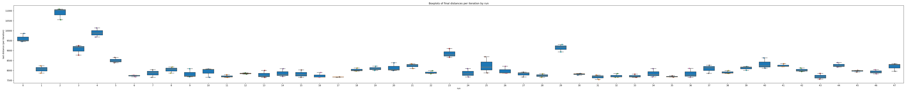
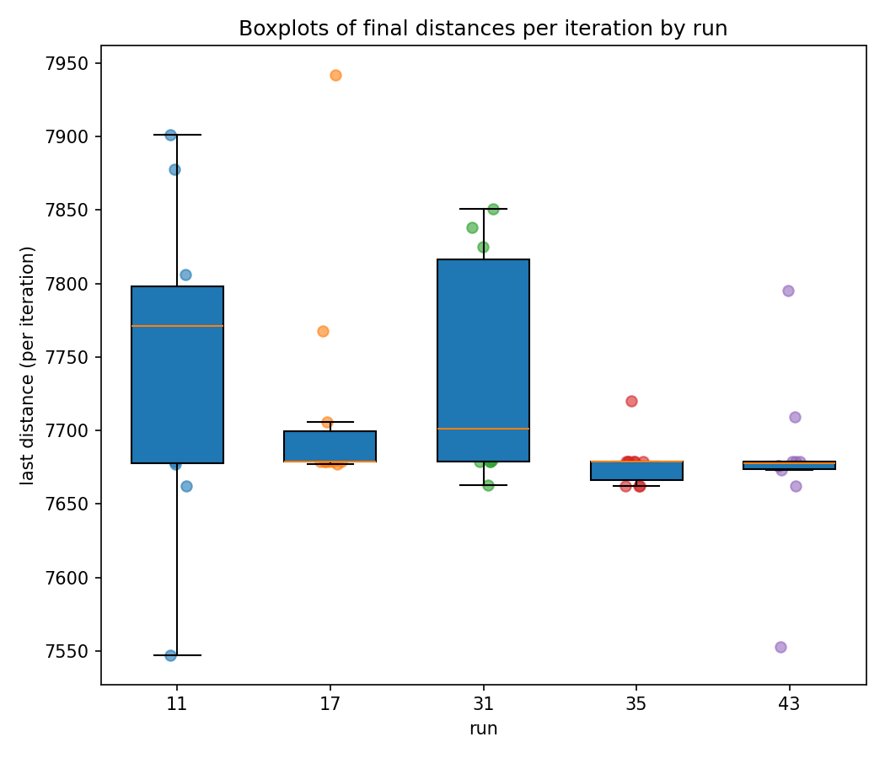
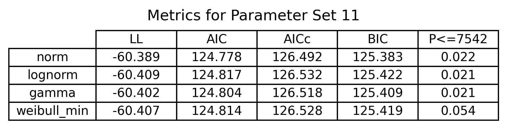
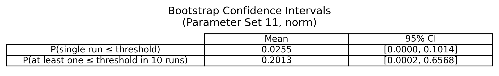

# Ant Colony Optimization

## Goal Question Metric Method (GQMM)

### Goal

Determine the probability that ant colony optimization (ACO) finds the global shortest path (7542) of TSPLIB berlin52.

### Questions

* What are the optimal parameters for ACO?
* How often does ACO reach the global optimum?
* How stable is the performance of ACO?

### Metrics

* Average tour length
* Probability of finding the optimal solution
* Confidence intervals of solution

### Methods

* Sobol sampling of parameter space, run ACO multiple times per configuration
* Repeated runs with best-performing parameter sets
* Bootstrap resampling

## Results

### Exploration

To find the optimal parameters for ACO, we apply Sobol sampling of the parameter space. We run ACO with many configurations for a small number of steps, and do this multiple times. The average shortest tour length per configuration is used to rank top performers.

### Exploitation

We repeat running ACO, but with few configurations and for a large number of steps, and do this a higher number of times. Using multiple parametric distributions and MLE, we calculate the probability of reaching the global shortest path with the cumulative distribution function (CDF). This gives us a solution for our probability with the raw data.

### Repetition

We use bootstrap resampling of our raw data from configuration exploitation. This lets us find variance in our results. Now, we can calculate the probability of finding the global shortest path across multiple runs of our exploitation.

